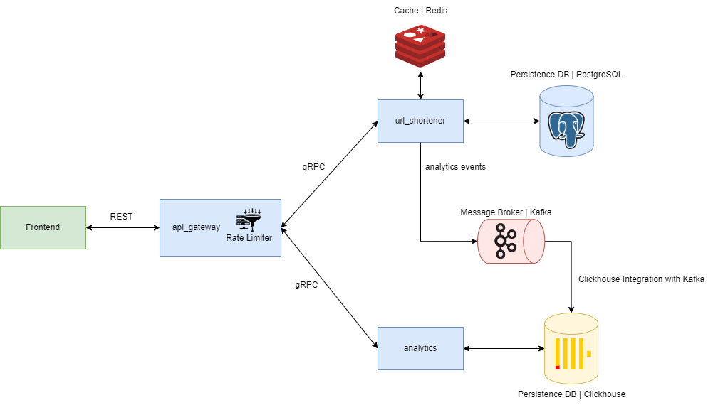

# Сокращатель ссылок
В рамках данных задач стоит амбициозный и креативный проект по созданию сервиса коротких ссылок, который удобно вписывается в современный веб-ландшафт. Наш сервис будет принимать на вход стандартные REST запросы, содержащие оригинальные URL-адреса, и выдавать в ответ компактные, укороченные версии с использованием домена localhost. Пользователи, перейдя по такой короткой ссылке, будут автоматически перенаправлены на изначальный, полный адрес ресурса.

В качестве образца можно рассматривать сервисы типа https://surl.li/ru, которые демонстрируют функционал и потенциал сокращения ссылок.

## Архитектура проекта
